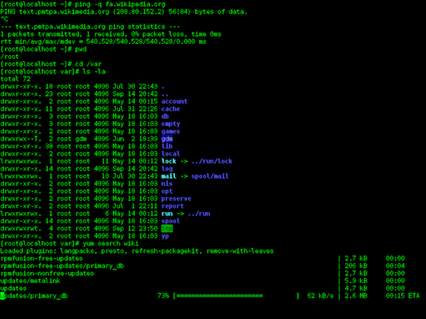
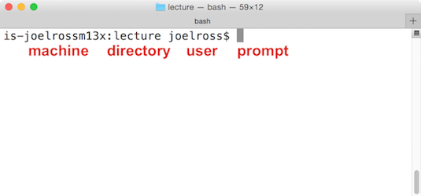
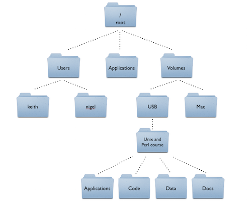
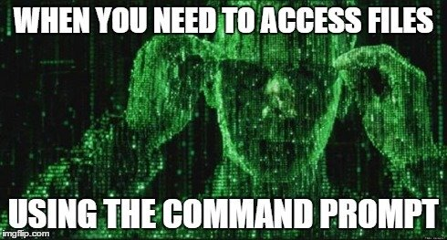
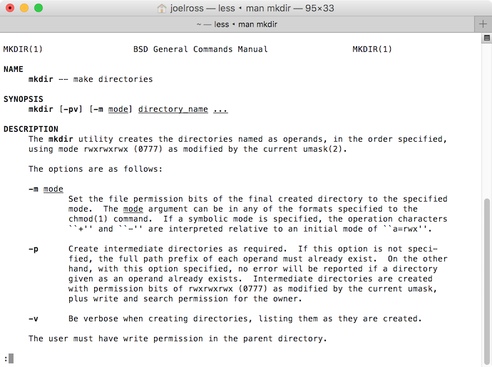
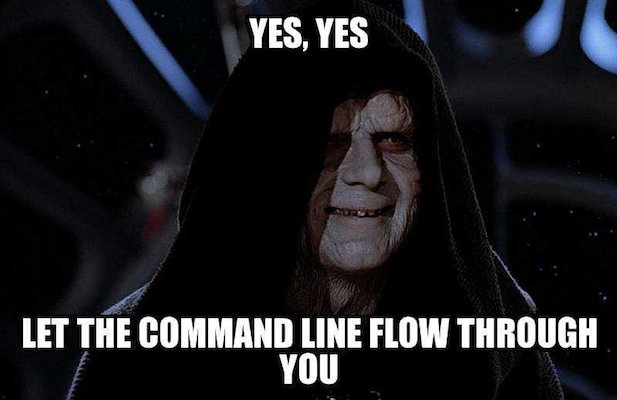

The **command-line** is an _interface_ to a computer---a way for you (the human) to communicate with the machine. But unlike common graphical interfaces that use <a href="https://en.wikipedia.org/wiki/WIMP_(computing)">windows, icons, menus, and pointers</a>, the command-line is _text-based_: you type commands instead of clicking on icons. The command-line lets you do everything you'd normally do by clicking with a mouse, but by typing in a manner similar to programming!



The command-line is not as friendly or intuitive as a graphical interface--it's much harder to learn and figure out. However, it has the advantage of being both more powerful and more efficient in the hands of expert users. (It's faster to type than to move a mouse, and you can do _lots_ of "clicks" with a single command). Thus all professional developers interact with the command-line, and many of the development tools you'll need only have a command-line interface (CLI) for you to use.

This tutorial will give you a brief introduction to using the command-line: enough to get you comfortable navigating the interface and able to interpret commands.

### Additional Resources
- [Learn Enough Command Line to be Dangerous](https://www.learnenough.com/command-line-tutorial#sec-basics)
- [Video series: Bash commands](https://www.youtube.com/watch?v=sqYUYHn-HKg&list=PLCAF7D691FFA25555)

## Accessing the Command-Line
In order to use the command-line, you will need to open a **command shell** (a.k.a. a _command prompt_). This is a program that provides the interface to type commands into. This tutorial assumes you're using a [Bash](https://en.wikipedia.org/wiki/Bash_(Unix_shell) shell, which provides a particular common set of commands, and defaults to using Mac terminology as examples.

- On a Mac you'll want to use the built-in app called **Terminal**. You can open it by searching via Spotlight (hit Cmd () and Spacebar together, type in "terminal", then select the app to open it), or by finding it in the Applications/Utilities folder.

- On Windows, I recommend using [Git Bash](https://git-scm.com/downloads), which includes the glorious [`git`](https://git-scm.com/book/en/v2/Getting-Started-About-Version-Control) program that is one of the best reasons to learn the command-line. This is already installed on the iSchool lab machines.

    - Windows does come with its own command-prompt (called the DOS Prompt), but it has a different set of commands and features. Bash is more common and so is covered here.

    - The Windows 10 Anniversary update (August 2016) _does_ include a beta version of an integrated Bash shell. You can access this by [enabling the subsystem for Linux](https://msdn.microsoft.com/en-us/commandline/wsl/install_guide) and then running `bash` in the command prompt. This is currently (Sep 2016) "beta" technology, but will suffice for most purposes.

Once you open up the shell (Terminal or Git Bash), you should see something like this (red notes are mine):



This is the textual equivalent of having opened up Finder or File Explorer and having it show you the "Home" folder. The text shown lets you know what machine you're currently interfacing with (you can use the command-line to control different computers across a network or the Internet), what **directory** (folder) you are currently looking at (`~` is a shorthand for the "home directory") and what user you are logged in as. After that you'll see the prompt, which is where you will type in your commands.

## Location, Location, Location
Although the command-prompt gives us the name of the folder we're in, you might like more detail about where that folder is. Time to send your first command! At the prompt, type:

```bash
pwd
```

This stands for **p**rint **w**orking **d**irectory (CLI commands are highly abbreviated to make them faster to type), and will tell the computer to print the folder you are currently "in".

- Fun fact: technically this command is start a tiny program (app) that does exactly one thing: prints the working directory. When you run a command, you're actually executing a tiny program! And when you run programs (tiny or large) on the command-line, it looks like you're typing in commands.

Folders on computers are stored in a hierarchy: each folder has more folders inside it, which have more folders inside them. This produces a ["tree"](https://en.wikipedia.org/wiki/Tree_(data_structure)) structure:



We describe what folder we are in putting a slash `/` between each folder: thus `/Users/iguest` means "the `iguest` folder, which is inside the `Users` folder.

At the very top (or bottom, depending on your point of view) we have the **root** `/` directory--which has no name, and so is just indicated with that single slash. So `/Users/iguest` really means "the `iguest` folder, which is inside the `Users` folder, which is inside the root folder".

### Changing Directories
What if we want to change folders? In a GUI system, we would just double-click on the folder to open it. But there's no clicking on the command-line.

- There includes clicking to move the cursor to an earlier part of the command you typed. You'll need to use the left and right arrow keys to move the cursor instead. **Protip:** The up and down arrow keys will let you cycle though your previous commands so you don't need to re-type them!

So we'll need to use another command:

```bash
cd folder_name
```

The first word is the **command**, or what we want the computer to do. In this case, we're issuing the command that means **c**hange **d**irectory. 

The second word is an example of an **argument**, which is a programming term that means "more details about what to do". In this case, we're providing a _required_ argument of what folder we want to change to! (You'll of course need to replace `folder_name` with the name of the folder).

- Try changing to the `Desktop` folder, which should be inside the home folder you starter in---you could see it in Finder!

- After you change folders, try printing your currently location. Can you see that it has changed?


### Listing Files
In a GUI, once you've double-clicked on a folder Finder will show you the contents of that folder. The command-line doesn't do this automatically, instead we need another command:

```bash
ls [folder_name]
```

This command says to **l**i**s**t the folder contents. Note that I've put the _argument_ here in brackets (`[]`) to indicate that it is _optional_. If you just issue the **`ls`** command, it will list the contents of the current folder. If you include the optional argument (leaving off the brackets), you can "peek" at the contents of a folder you are not currently in.

### Paths
Note that both the **`cd`** and **`ls`** commands work even for folders that are not "immediately inside" the current directory! We can refer to _any_ file or folder on the computer by specifying its **path**. A file's path is "how you get to that file": the list of folders we'd need to click through to get to the file, with each folder separated by a `/`:

```
/Users/iguest/Desktop/cli-tutorial.md
```

This says to start at the root directory (that initial `/`), then go to `Users`, then go to `iguest`, then to `Desktop`, and finally to the `cli-tutorial.md` file.

Because this path starts with the root directory, it is referred to as an **absolute path**. No matter what folder you currently happen to be in, that path will refer to the correct file because it starts from the root.

Contrast that with:

```
iguest/Desktop/cli-tutorial.md
```

Because this path doesn't have the leading slash, it just says to "go to the Desktop folder _from the current location_". Thus it is known as a **relative path**: it gives you directions to a file _relative the current folder_. Thus the relative path `iguest/Desktop/cli-tutorial.md` path will only refer to the correct file if we happen to be in the `/Users` folder; if we start somewhere else, who knows where we'll end up!

- You should almost **always** use relative paths, particularly when programming! That way file directions are more likely to work across computers (e.g., in case the username is different so your home folder is `janesmith` instead of `iguest`; with a relative path, `Desktop/cli-tutorial.md` will work for either person).

Finally, we can refer to the "current folder" by using a single dot **`.`**. So the command

```bash
ls .
```

means "list the contents of the current folder" (the same thing we get if we left off the argument).

If you want to go _up_ a directory, we use _two_ dots: **`..`** to refer to the _parent_ folder (that is, the one that contains this one). So the command

```bash
ls ..
```

means "list the contents of the folder that contains the current one".

Note that **`.`** and **`..`** act just like folder names, so you can include them anywhere in paths: `../../my_folder` says to go up two folders, and then into `my_folder`.

- **PROTIP** Most command shells like Terminal and Git Bash support **tab-completion**. If you type out just the first few letters of a file or folder name and then hit the `tab` key, it will automatically fill in the rest of the name! If the name is ambiguous (e.g., you type `Do` and there is both a `Documents` and a `Downloads` folder, you can hit `tab` _twice_ to see the list of matching folders. Then add enough letters to distinguish them and tab to complete!

#### Path Practice
Problem 1:

```bash
# if I start here:
$ pwd 
/Users/iguest/Desktop

# and then do this:
$ cd ../Desktop/lectures/.././..

#where do I end up?
```

Problem 2:

```bash
# if I start here:
$ pwd 
/Users/iguest/Desktop

# and then do this:
$ cd /../Desktop

#where do I end up?
```

## File Commands


Once you're comfortable navigating folders in the command-line, you can start to use it to do all the same things you would do with Finder or File Explorer, simply by using the correct command:

- **`mkdir`** will **m**a**k**e a **dir**ectory.
- **`rm`** will **r**e**m**ove a file.
- **`cp`** will **c**o**p**y a file from one location to another.
- **`cat`** will con**cat**enate (combine) file contents and display the results.

Be aware that many of these commands **won't print anything** when you run them. This often means that they worked; they just did so quietly. If it _doesn't_ work, you'll know because you'll see a message telling you so (and why). So just you didn't get any output doesn't mean you did something wrong--you can use another command (such as **`ls`**) to confirm that the files or folders changed the way you wanted!

### Learning New Commands
How can we figure out what kind of arguments these commands take? We can look it up! This information is available online, but many command shells (though not Git Bash) also include their own manual we can use to look up commands!

```bash
man mkdir
```

Will show the **man**ual for the **`mkdir`** program/command.

- Because manuals are often long, they are opened up in a command-line viewer called [less](). You can "scroll" up and down by using the arrow keys. Hit the `q` key to **q**uit and return to the command-prompt.



If you look under "Synopsis" you can see a summary of all the different arguments this command understands. A few notes about reading this syntax:

- Recall that anything in brackets `[]` is optional. Arguments that are not in brackets (e.g., `directory_name`) are required. 

- "Options" (or "flags") for command-line programs are often marked with a leading dash `-` to make them distinct from file or folder names. Options may change the way a CLI program behaves---like how you might set "easy" or "hard" mode in a game. You can either write out each option individually, or combine them: **`mkdir -p -v`** and **`mkdir -pv`** are equivalent.

    - Some options may require an additional argument beyond just indicating a particular operation style. In this case, you you can see that the `-m` option requires you to specify an additional `mode` parameter; see the details below for what this looks like.

- Underlined arguments are ones you choose: you don't actually type the word `directory_name`, but instead your own directory name! Contrast this with the options: if you want to use the `-p` option, you need to type `-p`.

Command-line manuals ("man pages") are often very difficult to read and understand: start by looking at just the required arguments (which are usually straightforward), and then search for and use a particular option if you're looking to change a command's behavior.

#### Practice
Can you read the man page and figure out how to delete a folder and not just a single file? Note that you'll want to be careful, as this is a good way to [break things](http://www.pcworld.com/article/3057235/data-center-cloud/that-man-who-deleted-his-entire-company-with-a-line-of-code-it-was-a-hoax.html).


### Dealing With Errors
Note that the syntax of these commands (how you write them out) is very important. Computers aren't good at figuring out what you meant if you aren't really specific; you can't forget spaces or anything.

Try another command: **`echo`** lets you "echo" (print out) some text. Try echoing `"Hello World"` (which is the traditional first computer program):

```bash
echo "Hello world"
```

But what happens if you forget the closing quote? You keep hitting "enter" but you just get that `>` over and over again! What's going on?

- This is because you didn't close the quote, so the shell thinks you are still typing the message you want to echo! When you hit "enter" it adds a line break instead of ending the command, and the `>` marks that you're still going. If you finally close the quote, you'll see  your multi-line message printed!

**IMPORTANT TIP** If you ever get stuck in the command-line, hit **`ctrl-c`** (The `control` and `c` keys together). This almost always means "cancel", and will "stop" whatever program/command is currently running in the shell so that you can try again. Just remember: "**`ctrl-c`** to flee".

- If that doesn't work, try hitting the `esc` key, or typing `exit`, `q`, or `quit`. That should cover most cases.


### Wildcards
One last note about working with files. Since you'll often work with multiple files, command shells offer some shortcuts to talking about files with the same name. In particular, you can use an asterisk `*` as a **wildcard** when naming files. This symbol acts like a "wild" or "blank" tile in Scrabble--it can be "replaced" by any character (or any set of characters) when determining what file(s) you're talking about.


- `*.txt` refers to all files that have `.txt` at the end. **`cat *.txt`** would output the contents of every `.txt` file in the folder.

- `hello*` refers to all files whose names start with `hello`.

- `hello*.txt` refer to all files that start with `hello` and end with `.txt`, no matter how many characters are in the middle (including none!)

- `*.*` refers to all files that have an extension.


## Directing Output
So far all these commands have either modified the file system or printed some output to the terminal. But we can specify that we want the output to go somewhere else (e.g., to save it to a file for later). These are called **redirects**. Redirect commands are usually single punctuation marks, because the commands want to be as quick to type (but hard to read!) as possible.

- `>` says "take output of command and put it in this file". For example `echo "Hello World" > hello.txt` will put the outputted text "Hello World" into a file called `hello.txt`. Note that this will replace any previous content in the file, or create the file if it doesn't exist. This is a great way to save the output of your command-line work!

- `>>` says "take output of command and _append_ it to the end of this file". This will keep you from overwriting previous content.

- `<` says "take input from this file". This is a much less common redirect.

- `|` says "take the output of this command and send it to the next command". For example, **`cat hello.txt | less`** would take the output of the `hello.txt` file and send it to the `less` program, which gives that arrow-based "scrolling" interface that man pages used.

Redirects are a more "advanced" usage of the command-line, but now you know what those random symbols mean if you see them!


## CLI Practice
To check that you're comfortable with the command-line, make sure you can perform the following tasks:

1. Open up a new Terminal (try the `cmd + n` shortcut!)

1. Navigate to your "Documents" folder

1. Create a new folder called "quick-exercise"

1. Navigate into that folder

1. Write "To be or not to be" into a file called "quote.txt"

1. Navigate to the "Desktop"

1. Display the contents of the "Documents/quote.txt" file in the Terminal (without changing directories again!)


